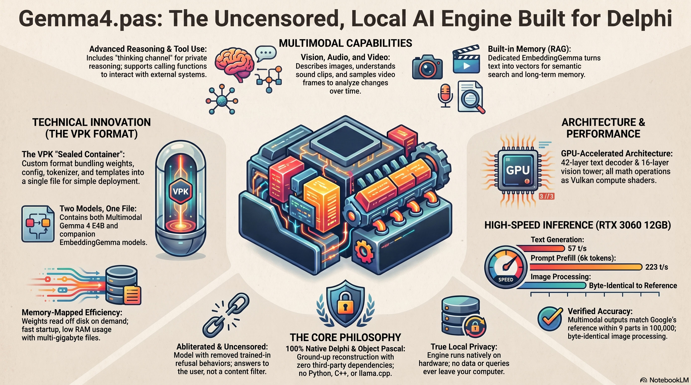

<div align="center">


[](https://discord.gg/Wb6z8Wam7p) [](https://bsky.app/profile/tinybiggames.com)

</div>

## What is Gemma4.pas?

**A complete multimodal AI inference engine for Google's Gemma 4 E4B, written entirely in Delphi.** No Python, no C/C++, no llama.cpp underneath -- zero third-party dependencies. Load a single VPK archive, call `TInference.Generate`, and stream tokens from your GPU.

```pascal
uses
  Gemma4.Types,
  Gemma4.Inference;

var
  LInf: TInference;
begin
  LInf := TInference.Create();
  try
    LInf.SetTokenCallback(
      procedure(const AState: TProgressState;
        const AToken: string; const AUserData: Pointer)
      begin
        if AState = psInProgress then
          Write(AToken);
      end, nil);

    LInf.LoadModel('C:\Dev\LLM\VPK\Gemma4.vpk');
    LInf.EnableThinking := True;
    LInf.AddMessage(CRoleUser, 'What makes Vulkan different from OpenGL?');
    LInf.Generate(1024);
  finally
    LInf.Free();
  end;
end.
```

Gemma4.pas runs the full Gemma 4 E4B model: text generation with a thinking/reasoning channel, vision, audio, and video, all accelerated through Vulkan compute shaders on the GPU. It also bundles an [EmbeddingGemma-300m](https://huggingface.co/google/embeddinggemma-300m) encoder for semantic search and RAG. The engine loads an abliterated checkpoint -- refusal behavior removed -- so the model stays genuinely helpful for any legitimate use. Everything runs locally. Nothing leaves your machine.

## 🎬 Media

<div align="center">
Infographic <br/>  



https://github.com/user-attachments/assets/22e43766-2bc3-478e-b928-633f4ad202b2

</div>

## 🎯 Who is Gemma4.pas For?

- **Delphi and Pascal developers**: integrate local LLM inference into your applications without leaving the Delphi ecosystem or depending on external runtimes.
- **Application developers**: a self-contained, single-file AI engine that runs on consumer hardware with full multimodal support -- text, images, audio, video, and embeddings.
- **Privacy-conscious users**: a model that runs entirely on your own machine with no network calls, no telemetry, and no content filtering.

## ✨ Key Features

- **Text generation**: streaming token output with configurable sampling (temperature, top-k, top-p) and a thinking/reasoning channel where the model reasons privately before answering.
- **Tool use**: the model can call functions via structured tool declarations and a complete Jinja chat template engine.
- **Vision**: describe images at variable detail levels (70 to 1120 soft tokens). VCL Graphics decode -- no third-party image libraries.
- **Audio**: understand speech and sound from WAV files (PCM16/F32, any sample rate). 12-layer conformer encoder.
- **Video**: sample frames across a clip and describe temporal content. Windows Media Foundation frame extraction, reuses the vision tower.
- **Embeddings and RAG**: bundled EmbeddingGemma-300m (24-layer bidirectional, 768-dim output) for semantic search, document retrieval, and memory.
- **Single-file deployment**: one VPK archive holds both models (Gemma 4 E4B + EmbeddingGemma-300m), ready to memory-map and run.
- **4-bit quantization**: Q4_0 decoder weights with DP4A integer dot products; vision/audio/embedding encoders stay at full F32 precision.
- **Vulkan compute**: all matrix math, attention, softmax, and normalization run on the GPU as compiled SPIR-V shaders.
- **Zero dependencies**: pure Delphi -- no DLLs, no Python, no C runtime.

## 🚀 Getting Started

### Download the Model

Download the pre-packed VPK archive from HuggingFace:

**[📦 Download Gemma4.vpk](https://huggingface.co/buckets/tinybiggames/Gemma4.pas/resolve/Gemma4.vpk?download=true)**

Place the file at `C:\Dev\LLM\VPK\Gemma4.vpk`. This is the default path the testbed demos look for. If you place it somewhere else, change the path constant in your code.

### Run the Testbed

1. Clone the repository: `git clone https://github.com/tinyBigGAMES/Gemma4.pas.git`
2. Open `projects\Testbed\Testbed.dproj` in Delphi 12 Athens or higher
3. Build and run (Win64 target)
4. The testbed menu offers four demos: Pack, Inference, Embedding, and Multimedia

### Minimal Example

```pascal
LInf := TInference.Create();
try
  LInf.LoadModel('C:\Dev\LLM\VPK\Gemma4.vpk');
  LInf.EnableThinking := True;
  LInf.AddMessage(CRoleUser, 'Hello, world!');
  LInf.Generate(1024);
  WriteLn(LInf.ResponseText);
finally
  LInf.Free();
end;
```

The model's chat template is applied automatically -- you never construct prompt text by hand. For multi-turn conversations, feed the response back:

```pascal
LInf.AddMessage(CRoleAssistant, LInf.ResponseText);
LInf.AddMessage(CRoleUser, 'Tell me more.');
LInf.Generate(1024);
```

### Multimodal

Image, audio, and video are first-class message parts:

```pascal
// Image (image before text per model card)
LInf.AddMessage(CRoleUser, [
  TMessagePart.ImagePart('photo.png'),
  TMessagePart.TextPart('Describe this image.')
]);
LInf.Generate(512);

// Audio (text before audio per model card)
LInf.AddMessage(CRoleUser, [
  TMessagePart.TextPart('Describe this audio.'),
  TMessagePart.AudioPart('speech.wav')
]);
LInf.Generate(512);

// Video (video before text per model card)
LInf.AddMessage(CRoleUser, [
  TMessagePart.VideoPart('clip.mp4'),
  TMessagePart.TextPart('Describe this video.')
]);
LInf.Generate(512);
```

### Embeddings

```pascal
LEmb := TEmbeddings.Create();
try
  LEmb.Open('C:\Dev\LLM\VPK\Gemma4.vpk');
  LQuery := LEmb.EmbedQuery('Which planet is the Red Planet?');
  LDoc := LEmb.EmbedDocument('Mars is often called the Red Planet.');
  WriteLn(TEmbeddings.Similarity(LQuery, LDoc):0:4);
finally
  LEmb.Free();
end;
```

## ⚡ Performance

Measured on an NVIDIA RTX 3060 (12 GB VRAM):

| Metric | Value |
|--------|-------|
| Text generation | ~57 tokens/sec |
| Prefill (5972-token prompt) | ~223 tokens/sec |
| Vision encoder parity | ~9.5e-5 max abs diff vs HuggingFace |
| Audio encoder parity | ~1.96e-4 max abs diff vs HuggingFace |

## 📖 Documentation

The full API reference, architecture guide, and how-to recipes are in a single document:

| Document | Description |
|----------|-------------|
| **[Gemma4.pas Documentation](docs/Gemma4-pas.md)** | Complete tour: `TInference` API (loading, messages, generation, thinking, multimodal, stats), `TEmbeddings` API, architecture (42-layer decoder, Vulkan pipeline, Q4_0 quantization, VPK format, vision/audio/video encoders, embeddings model), and practical how-to recipes with verified testbed code. |

## 🔨 Building from Source

### Prerequisites

| | Requirement |
|---|---|
| **Host OS** | Windows x64 |
| **GPU** | NVIDIA with Vulkan compute (tested on RTX 3060 12 GB) |
| **Compiler** | Delphi 12 Athens or higher |

### Get the Source

```bash
git clone https://github.com/tinyBigGAMES/Gemma4.pas.git
```

### Compile

1. Open `projects\Testbed\Testbed.dproj` in Delphi 12 Athens or higher
2. Build (Win64 target)
3. Download [Gemma4.vpk](https://huggingface.co/buckets/tinybiggames/Gemma4.pas/resolve/Gemma4.vpk?download=true) to `C:\Dev\LLM\VPK\Gemma4.vpk`
4. Run the testbed -- it offers Inference, Embedding, Multimedia, and Pack demos

## 🤝 Contributing

Gemma4.pas is an open project and contributions are welcome at every level:

- **Report bugs**: open an issue with a minimal reproduction, the exact code used, and your GPU model.
- **Suggest features**: describe the use case first, then the proposed API or behavior.
- **Submit pull requests**: bug fixes, documentation improvements, new test cases, and well-scoped features.

Join our [Discord](https://discord.gg/Wb6z8Wam7p) to discuss development, ask questions, or share what you are building with Gemma4.pas.

## 💙 Support the Project

If Gemma4.pas saves you time, sparks an idea, or becomes part of something you ship:

- **Star the repo** -- helps others find the project
- **Spread the word** -- write a post, mention it on social media
- **Join us on [Discord](https://discord.gg/Wb6z8Wam7p)** -- share what you are building
- **Become a sponsor** via [GitHub Sponsors](https://github.com/sponsors/tinyBigGAMES) -- directly funds development

## 📄 License

Gemma4.pas is licensed under the **Apache License 2.0**. See [LICENSE](https://github.com/tinyBigGAMES/Gemma4.pas?tab=License-1-ov-file#) for details.

## 🔗 Links

- [GitHub](https://github.com/tinyBigGAMES/Gemma4.pas)
- [Discord](https://discord.gg/Wb6z8Wam7p)
- [Bluesky](https://bsky.app/profile/tinybiggames.com)
- [tinyBigGAMES](https://tinybiggames.com)

<div align="center">

**Gemma4.pas**&#8482; - Local LLM inference in Pascal.

Copyright &copy; 2026-present tinyBigGAMES&#8482; LLC
All Rights Reserved.

</div>
