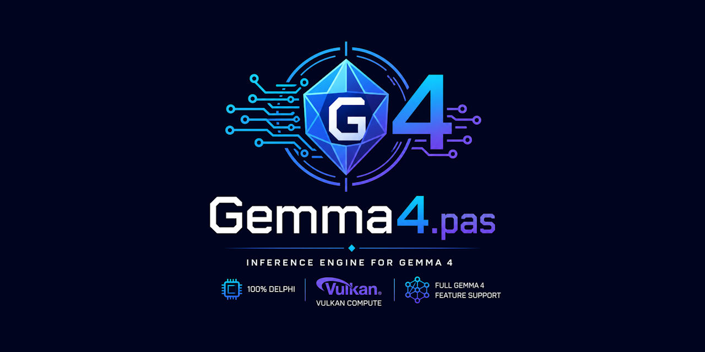

<div align="center">



</div>

<a id="what-is-gemma4pas"></a>

## 🚀 What is Gemma4.pas?

**Gemma4.pas** is a complete inference engine for Google's [Gemma 4 E4B](https://ai.google.dev/gemma) multimodal model, written entirely in Delphi (Object Pascal). No Python, no C/C++, no llama.cpp underneath -- zero third-party dependencies. Just Delphi and your GPU.

It runs the full model: text generation with a thinking/reasoning channel, vision (image description), audio (speech understanding), and video (temporal scene description), with all heavy math accelerated through Vulkan compute shaders. It also ships a bundled [EmbeddingGemma-300m](https://huggingface.co/google/embeddinggemma-300m) encoder for semantic search and retrieval-augmented generation (RAG).

The engine loads an abliterated Gemma 4 E4B checkpoint -- the trained-in refusal behavior has been removed, so the model stays genuinely helpful for any legitimate use. Everything runs locally on your machine. Nothing you ask ever leaves your computer.

```
Download Gemma4.vpk  ->  TInference.LoadModel  ->  AddMessage  ->  Generate  ->  tokens
```

> [!TIP]
> 💡 **Fast path:** read [Getting Started](#getting-started), then skim the [API Reference](#api-reference) and [How-To Guide](#how-to-guide).

### 🚦 Documentation Roadmap

| Reader Goal | Start Here | Why |
|-------------|------------|-----|
| 🚀 Run your first inference | [Getting Started](#getting-started) | Download the model, load it, generate your first response |
| 🔌 Learn the API | [API Reference](#api-reference) | `TInference` public surface: loading, messages, generation, thinking, multimodal, stats |
| 🧪 Solve a task | [How-To Guide](#how-to-guide) | Practical recipes: streaming chat, multi-turn, image/audio/video, embeddings |
| 🏗️ Understand the internals | [Architecture](#architecture) | Model structure, Vulkan pipeline, quantization, VPK format, encoders |
### 💡 Why Gemma4.pas?

Almost every serious language model engine is written in C or C++. The Delphi ecosystem had nothing. Gemma4.pas proves it can be done: a production-quality, competitive inference engine built natively in Delphi, with no external libraries. Every piece -- the tokenizer, the quantizer, the Vulkan compute layer, the Jinja template engine -- was built from scratch in Pascal.

The bar was set high on purpose: match llama.cpp, the tool everyone benchmarks against.

> [!IMPORTANT]
> 🧱 This is not a toy and not a thin wrapper around someone else's work. Every component was hand-built in Delphi from the ground up.

### ✨ Key Features

| Feature | What It Means |
|---------|---------------|
| **💬 Text generation** | Streaming token output with configurable sampling (temperature, top-k, top-p) |
| **🧠 Thinking channel** | The model reasons privately before answering; reasoning is optionally visible |
| **🔧 Tool use** | The model can call functions via structured tool declarations |
| **👁️ Vision** | Describe images at variable detail levels (70 to 1120 soft tokens) |
| **🎙️ Audio** | Understand speech and sound from WAV files |
| **🎬 Video** | Sample frames across a clip and describe temporal content |
| **🔍 Embeddings and RAG** | EmbeddingGemma-300m for semantic search, document retrieval, and memory |
| **🧾 Jinja chat template** | Every prompt matches exactly how the model was trained |
| **📦 4-bit quantization** | Q4_0 decoder weights for compact storage; encoders stay at full F32 precision |
| **📁 Single-file deployment** | One VPK archive holds both models, ready to memory-map and run |
| **⚡ Vulkan compute** | All matrix math, attention, softmax, and normalization run on the GPU |
| **🧰 Zero dependencies** | Pure Delphi -- no DLLs, no Python, no C runtime |

### 🏗️ Architecture at a Glance

```
Gemma4.vpk (single archive)
    |
    +-- E4B/ (Gemma 4 text + multimodal)
    |     weights.bin      Q4_0 decoder (42 layers, 2560 hidden)
    |     encoders.bin     F32 vision (16L) + audio (12L conformer)
    |     tokenizer.json   262144-token BPE vocabulary
    |     chat_template.jinja
    |
    +-- embeddings/ (EmbeddingGemma-300m)
          weights.bin      F32 bidirectional encoder (24L, 768 hidden)
          tokenizer.json

    TInference.LoadModel('Gemma4.vpk')
        |
        v
    Memory-map weights --> Vulkan GPU upload
        |
        v
    AddMessage (text / image / audio / video parts)
        |
        v
    Generate --> Jinja template --> tokenize --> GPU forward pass
        |
        v
    Stream tokens via callback
```

The text decoder is a 42-layer transformer with a hybrid attention pattern: five sliding-window layers followed by one full-attention layer, repeated seven times. It uses grouped-query attention (8 query heads, 2 KV heads) with a shared KV cache across 18 layers. Per-layer embeddings (PLE) provide richer representations at each layer.

On top of the language model sit the encoders: a 16-layer SigLIP vision tower for images, a 12-layer conformer for audio, and frame extraction for video that reuses the vision tower.

> [!NOTE]
> 🧩 The two models -- Gemma 4 E4B (text + multimodal) and EmbeddingGemma-300m (semantic embeddings) -- are bundled into a single VPK archive. One file to download, one file to load.
### ⚡ Performance

Measured on an NVIDIA RTX 3060 (12 GB VRAM):

| Metric | Value |
|--------|-------|
| 💬 Text generation | ~57 tokens/sec |
| 📥 Prefill (long prompt) | ~223 tokens/sec (5972-token input) |
| 👁️ Vision encoder parity | max abs diff ~9.5e-5 vs HuggingFace reference |
| 🎙️ Audio encoder parity | max abs diff ~1.96e-4 vs HuggingFace reference |

### 🎯 Who Is This For?

- **🖥️ Delphi and Pascal developers** who want to integrate local LLM inference into their applications without leaving the Delphi ecosystem or depending on external runtimes.
- **📦 Application developers** who need a self-contained, single-file AI engine that runs on consumer hardware with full multimodal support.
- **🔒 Privacy-conscious users** who want a model that runs entirely on their own machine with no network calls, no telemetry, and no content filtering.

### 📌 Current Status

The engine is feature-complete across all planned modalities:

- 💬 Text generation with thinking/reasoning channel
- 🔧 Tool use via structured tool declarations and the Jinja template engine
- 👁️ Vision (image description at variable detail levels)
- 🎙️ Audio (speech and sound understanding)
- 🎬 Video (temporal scene description via frame sampling)
- 🔍 Embeddings (EmbeddingGemma-300m semantic search and retrieval)
- ⚡ Batched prefill (~223 t/s) and optimized generation (~57 t/s)
- ✅ Byte-exact template rendering verified against HuggingFace `apply_chat_template`

> [!TIP]
> 💡 The exact public API always lives in `Gemma4.Inference.pas`. When the docs and the source ever seem to disagree, the source is authoritative.

### 💻 System Requirements

| Area | Requirement |
|------|-------------|
| **🪶 Operating system** | Windows x64 |
| **🖥️ GPU** | NVIDIA GPU with Vulkan compute support (tested on RTX 3060 12 GB) |
| **💾 VRAM** | 12 GB recommended |
| **📦 Runtime dependencies** | None |
| **🔧 Building from source** | Delphi 12 Athens or higher |

### 🗺️ Table of Contents

- 🚀 [Getting Started](#getting-started): download the model, load it, run your first inference
- 🔌 [API Reference](#api-reference): `TInference` public surface, `TEmbeddings`, types, callbacks, constants
- 🏗️ [Architecture](#architecture): model internals, Vulkan pipeline, quantization, VPK format, encoders
- 🧪 [How-To Guide](#how-to-guide): practical recipes with complete code from the testbed

<a id="getting-started"></a>

## 🚀 Getting Started

Gemma4.pas ships as Delphi source code. You compile it with Delphi 12 Athens or higher, download the pre-packed model archive, and run inference with a few lines of code.

> [!NOTE]
> 🪶 Gemma4.pas targets Windows x64. The Vulkan compute shaders run on NVIDIA GPUs with up-to-date drivers -- no separate Vulkan SDK install is needed at runtime.

### ⚙️ Prerequisites

| Requirement | Details |
|-------------|---------|
| **🔧 Delphi** | 12 Athens or higher |
| **🖥️ GPU** | NVIDIA GPU with Vulkan compute support (tested on RTX 3060 12 GB) |
| **💾 Disk space** | ~5 GB for the Gemma4.vpk model archive |
| **📦 Vulkan driver** | Ships with modern NVIDIA drivers -- no separate SDK install needed at runtime |

### ⬇️ Step 1: Get the Source

Clone the repository:

```
git clone https://github.com/tinyBigGAMES/Gemma4.pas.git
```

### 📥 Step 2: Download the Model

Download the pre-packed VPK archive from HuggingFace:

[📦 Download Gemma4.vpk](https://huggingface.co/buckets/tinybiggames/Gemma4.pas/resolve/Gemma4.vpk?download=true)

Place the file at `C:\Dev\LLM\VPK\Gemma4.vpk`. This is the default path the testbed demos look for. If you place it somewhere else, change the path constant in your code.

> [!IMPORTANT]
> 🧱 The VPK archive contains both models: Gemma 4 E4B (text + multimodal) and EmbeddingGemma-300m (semantic embeddings). One file, one download.

### ✍️ Step 3: Your First Inference

Open the testbed project at `projects\Testbed\Testbed.dproj` in the Delphi IDE and build it. Or write the following in your own project:

```pascal
uses
  Gemma4.Types,
  Gemma4.Inference;

var
  LInf: TInference;
  LStats: TInferenceStats;
begin
  LInf := TInference.Create();
  try
    // Wire up streaming output
    LInf.SetTokenCallback(
      procedure(const AState: TProgressState;
        const AToken: string; const AUserData: Pointer)
      begin
        if AState = psInProgress then
          Write(AToken);
      end, nil);

    // Load the model
    if not LInf.LoadModel('C:\Dev\LLM\VPK\Gemma4.vpk') then
    begin
      WriteLn('LoadModel failed');
      LInf.PrintErrors();
      Exit;
    end;

    // Enable thinking (model reasons before answering)
    LInf.EnableThinking := True;
    LInf.ShowThinking := True;

    // Add a user message and generate
    LInf.AddMessage(CRoleUser,
      'In two sentences, what makes the Vulkan API different from OpenGL?');

    if not LInf.Generate(1024) then
    begin
      WriteLn('Generation failed');
      LInf.PrintErrors();
      Exit;
    end;

    WriteLn;

    // Print generation statistics
    LStats := LInf.Stats;
    WriteLn(LStats.FormatText(sdkBasic));
  finally
    LInf.Free();
  end;
end.
```

That is the whole loop: load the VPK, add a message, generate, read the streamed tokens. The model's chat template is applied automatically -- you never construct prompt text by hand.

> [!TIP]
> 💡 `Generate()` applies the model's real Jinja chat template over your message history. You work with messages, not raw prompt strings.

### 🔁 Step 4: Multi-Turn Conversation

To continue a conversation, feed the model's response back into the history:

```pascal
// First turn
LInf.AddMessage(CRoleUser, 'What is Vulkan?');
LInf.Generate(1024);
LInf.AddMessage(CRoleAssistant, LInf.ResponseText);

// Second turn (depends on the first)
LInf.AddMessage(CRoleUser, 'Give one concrete example.');
LInf.Generate(1024);
```

`ResponseText` contains the visible reply only (thinking stripped). `Response` contains the full text including thinking markers.

### 🔍 Step 5: Your First Embedding

```pascal
uses
  Gemma4.Embeddings;

var
  LEmb: TEmbeddings;
  LQueryVec: TArray<Single>;
  LDocVec: TArray<Single>;
  LSim: Single;
begin
  LEmb := TEmbeddings.Create();
  try
    if not LEmb.Open('C:\Dev\LLM\VPK\Gemma4.vpk') then
    begin
      WriteLn('Open failed');
      LEmb.PrintErrors();
      Exit;
    end;

    LQueryVec := LEmb.EmbedQuery('Which planet is the Red Planet?');
    LDocVec := LEmb.EmbedDocument(
      'Mars is often referred to as the Red Planet.');
    LSim := TEmbeddings.Similarity(LQueryVec, LDocVec);

    WriteLn('Similarity: ', LSim:0:4);
  finally
    LEmb.Free();
  end;
end.
```

`EmbedQuery` and `EmbedDocument` apply the model's exact trained prompt prefixes. `Similarity` computes cosine similarity between two normalized embeddings.

### 🧯 Common First-Run Issues

| Symptom | Likely Cause | Fix |
|---------|-------------|-----|
| ❌ `LoadModel failed` | VPK file not found at the specified path | Verify the path to `Gemma4.vpk`; the default is `C:\Dev\LLM\VPK\Gemma4.vpk` |
| ❌ Vulkan initialization failure | GPU driver does not support Vulkan compute | Update your NVIDIA driver to the latest version |
| ❌ Out of VRAM | GPU has less than ~4 GB free | Close other GPU-intensive applications; 12 GB VRAM recommended |
| ⚠️ Very slow generation | Weights fell back to host-visible memory | Ensure enough contiguous VRAM is free for the ~2.7 GB weight upload |
| ⚠️ No output from token callback | Callback not wired before `Generate` | Call `SetTokenCallback` before `Generate` |

<a id="api-reference"></a>

## 🔌 API Reference

The primary user-facing class is `TInference` in `Gemma4.Inference.pas`. It handles model loading, conversation management, chat template rendering, generation, and streaming output. Everything flows through this single class.

### 💬 TInference

Declared in `Gemma4.Inference.pas`. Extends `TBaseObject`.

#### 📦 Loading and Lifecycle

```pascal
function LoadModel(const AVpkPath: string;
  const AUseGPU: Boolean = True): Boolean;
```

Opens a VPK archive, loads the model config, tokenizer, weights, chat template, and initializes Vulkan compute. Returns `True` on success. On failure, call `PrintErrors()` for diagnostics.

```pascal
procedure UnloadModel();
function IsLoaded(): Boolean;
```

Release all resources, or check whether a model is currently loaded.

#### 📝 Conversation History

```pascal
procedure AddMessage(const ARole: string; const AContent: string);
```

Appends a text-only message to the conversation history. Use the role constants `CRoleUser`, `CRoleAssistant`, `CRoleSystem`, or `CRoleTool`.

```pascal
procedure AddMessage(const ARole: string;
  const AParts: TArray<TMessagePart>);
```

Appends a multimodal message. Each `TMessagePart` is a text, image, audio, or video segment. Parts render in order through the chat template.

```pascal
procedure AddToolResult(const AToolName: string; const AContent: string);
```

Appends a tool-result turn (role `'tool'`). `AContent` is the tool's output text.

```pascal
procedure ClearMessages();
procedure ResetConversation();
```

`ClearMessages` empties the message history. `ResetConversation` also clears the KV cache.

#### 🔧 Tool Definitions

```pascal
procedure SetTools(const AToolsJson: string);
```

Registers tool schemas for the template's `tools` block. Pass a JSON array of HuggingFace-style tool schemas. Pass `''` to clear.

#### ⚡ Generation

```pascal
function Generate(const AMaxTokens: Integer = 2048): Boolean;
```

Renders the chat template over the full message history, tokenizes, runs the GPU forward pass, and streams tokens through the token callback. Returns `True` on success.

After generation:
- `Response` -- the full normalized text, including `<thinking>`/`</thinking>` markers
- `ResponseText` -- visible text only, with thinking content stripped

> [!TIP]
> 💡 Feed `ResponseText` back into the history with `AddMessage(CRoleAssistant, LInf.ResponseText)` to maintain multi-turn context.

```pascal
function RenderPrompt(): string;
```

Renders the chat template without generating -- the exact prompt text that `Generate` would tokenize. Useful for debugging and template verification.

#### 🔔 Callbacks

```pascal
procedure SetTokenCallback(const ACallback: TTokenCallback;
  const AUserData: Pointer = nil);
```

Streaming callback for generated display text. The callback signature:

```pascal
TTokenCallback = reference to procedure(
  const AState: TProgressState;
  const AToken: string;
  const AUserData: Pointer);
```

| State | When It Fires |
|-------|---------------|
| `psPrep` | Before template rendering |
| `psStart` | Before the generation loop |
| `psInProgress` | Per emitted display fragment |
| `psEnd` | Generation complete |

```pascal
procedure SetCancelCallback(const ACallback: TCancelCallback;
  const AUserData: Pointer = nil);
```

Polled during generation. Return `True` from the callback to stop cleanly:

```pascal
TCancelCallback = reference to function(
  const AUserData: Pointer): Boolean;
```

```pascal
procedure SetLoadProgressCallback(
  const ACallback: TLoadProgressCallback;
  const AUserData: Pointer = nil);
```

Reports model loading progress (weight upload to GPU). The callback signature:

```pascal
TLoadProgressCallback = reference to procedure(
  const AState: TProgressState;
  const AStep: Integer;
  const ATotal: Integer;
  const AUserData: Pointer);
```

#### 🎲 Sampling Parameters

```pascal
procedure SetTemperature(const AValue: Single);
procedure SetTopK(const AValue: Integer);
procedure SetTopP(const AValue: Single);
property SamplingParams: TSamplingParams
  read FSamplingParams write FSamplingParams;
```

#### 🧠 Thinking Channel

```pascal
property EnableThinking: Boolean
  read FEnableThinking write FEnableThinking;
```

When `True`, the chat template injects the `<|think|>` token that activates the model's reasoning mode. The model generates a private reasoning span before the visible answer.

```pascal
property ShowThinking: Boolean
  read FShowThinking write FShowThinking;
```

When `False`, the reasoning span is hidden from the token callback behind `ThinkingPlaceholderText` (displayed once per span). `Response` and `ResponseText` are unaffected -- they always contain the full text.

```pascal
property ThinkingOpenText: string
  read FThinkOpenText write FThinkOpenText;
property ThinkingCloseText: string
  read FThinkCloseText write FThinkCloseText;
property ThinkingPlaceholderText: string
  read FThinkPlaceholder write FThinkPlaceholder;
```

Customize the markers emitted around thinking spans. Defaults: `<thinking>\n` / `\n</thinking>\n` / `Thinking...\n`. Set both open and close to `''` to strip markers entirely.

> [!NOTE]
> 🧩 The thinking channel normalizes Gemma 4's native markers (`<|channel>thought` / `<channel|>`) to the standard `<thinking>` / `</thinking>` format automatically.

#### 📊 Info and Stats

```pascal
function GetModelName(): string;
function GetDeviceName(): string;
function GetVocabSize(): Integer;
property Stats: TInferenceStats read FStats;
```

`Stats` is populated after each `Generate` call. Use `Stats.FormatText(sdkBasic)` for the standard one-line report or `Stats.FormatText(sdkDetailed)` for the full CPU/GPU phase split.

---

### 🧩 TMessagePart

Declared in `Gemma4.Inference.pas`. One content segment of a multimodal message.

```pascal
TPartKind = (pkText, pkImage, pkAudio, pkVideo);

TMessagePart = record
  Kind: TPartKind;
  Text: string;         // text content (pkText only)
  SourcePath: string;   // file path (media parts only)
  SoftBudget: Integer;  // image: soft-token count; video: frame count
end;
```

Static constructors:

```pascal
class function TextPart(const AText: string): TMessagePart; static;
class function ImagePart(const APath: string;
  const ASoftBudget: Integer = 1120): TMessagePart; static;
class function AudioPart(const APath: string): TMessagePart; static;
class function VideoPart(const APath: string;
  const AFrameCount: Integer = 32): TMessagePart; static;
```

> [!TIP]
> 💡 Image soft-token budgets: 70, 140, 280, 560, 1120. Higher budgets give more detail at the cost of more tokens. Video frame counts range from 1 to 60.

---

### 🔍 TEmbeddings

Declared in `Gemma4.Embeddings.pas`. Text embedding engine using the bundled EmbeddingGemma-300m model.

```pascal
function Open(const AVpkPath: string): Boolean;
procedure Close();
function IsLoaded(): Boolean;
```

Opens the VPK, loads the embeddings model (24-layer bidirectional encoder, F32), and initializes GPU compute.

```pascal
function Embed(const AText: string): TArray<Single>;
function EmbedQuery(const AText: string): TArray<Single>;
function EmbedDocument(const AText: string): TArray<Single>;
```

`Embed` returns a raw 768-dimensional L2-normalized vector. `EmbedQuery` and `EmbedDocument` prepend the model's trained prompt prefixes (`task: search result | query: ` and `title: none | text: ` respectively) before embedding.

```pascal
class function Similarity(const AA: TArray<Single>;
  const AB: TArray<Single>): Single; static;
```

Cosine similarity between two normalized embeddings. Range: -1.0 to 1.0.

---

### 📋 Key Constants

Declared in `Gemma4.Inference.pas`:

| Constant | Value | Purpose |
|----------|-------|---------|
| `CRoleUser` | `'user'` | User message role |
| `CRoleAssistant` | `'assistant'` | Assistant message role |
| `CRoleSystem` | `'system'` | System message role |
| `CRoleTool` | `'tool'` | Tool result role |

Declared in `Gemma4.Types.pas`:

| Constant | Value | Purpose |
|----------|-------|---------|
| `CHiddenSize` | 2560 | Text decoder hidden dimension |
| `CNumHiddenLayers` | 42 | Number of decoder layers |
| `CVocabSize` | 262144 | Vocabulary size |
| `CSlidingWindow` | 512 | Sliding attention window size |

### 📋 Key Types

`TProgressState` (declared in `Gemma4.Types.pas`):

| Value | Meaning |
|-------|---------|
| `psPrep` | Preparation phase |
| `psStart` | Operation starting |
| `psInProgress` | Data arriving (tokens, progress steps) |
| `psEnd` | Operation complete |

`TInferenceStats` (declared in `Gemma4.Types.pas`):

| Field | Type | Meaning |
|-------|------|---------|
| `TokenCount` | `Integer` | Generated token count |
| `ElapsedSec` | `Double` | Generation wall-clock time |
| `TokensPerSec` | `Double` | Generation speed |
| `PrefillTokenCount` | `Integer` | Prompt tokens processed |
| `PrefillSec` | `Double` | Prefill wall-clock time |
| `PrefillTokensPerSec` | `Double` | Prefill speed |

> [!TIP]
> 💡 Use `FormatText(sdkBasic)` for a formatted one-line summary or `FormatText(sdkDetailed)` for the full breakdown including per-phase CPU and GPU timing.

<a id="architecture"></a>

## 🏗️ Architecture

This section covers the internals of Gemma4.pas: the model architecture, the Vulkan compute pipeline, quantization, the VPK file format, and the multimodal encoders. You do not need any of this to use `TInference` -- it is here for developers who want to understand what happens beneath the API.

### 🗺️ Unit Map

```
Gemma4.Types.pas        Shared types, records, constants, enums
Gemma4.Config.pas       Model config loader (config.json)
Gemma4.Tokenizer.pas    BPE tokenizer (tokenizer.json, 262144 tokens)
Gemma4.Tensors.pas      Tensor storage, views, basic ops
Gemma4.Quant.pas        Q4_0 quantization and dequantization
Gemma4.Safetensors.pas  Safetensors file parser (header + tensor map)
Gemma4.Packer.pas       Offline packing tool: safetensors -> VPK
Gemma4.Attention.pas    RoPE, GQA, sliding window + full attention, KV cache
Gemma4.Layers.pas       RMSNorm, GeLU MLP, residual connections
Gemma4.Model.pas        Forward pass orchestration, generation loop
Gemma4.Vulkan.pas       Vulkan instance, device, queues, buffer management
Gemma4.Shaders.pas      SPIR-V shader loading and pipeline cache
Gemma4.Compute.pas      GPU kernel dispatch (GEMM, softmax, RoPE, etc.)
Gemma4.Jinja.pas        Full Jinja template engine for chat formatting
Gemma4.Image.pas        Image decode, resize, patchify (VCL Graphics)
Gemma4.Vision.pas       SigLIP vision encoder (16 layers, F32 GPU)
Gemma4.Audio.pas        Conformer audio encoder (12 layers, F32 GPU)
Gemma4.Video.pas        Video frame extraction (Windows Media Foundation)
Gemma4.Embeddings.pas   EmbeddingGemma-300m bidirectional encoder
Gemma4.Inference.pas    Top-level API: messages, template, generate, stream
```

> [!NOTE]
> 🧩 Dependencies flow downward. `Inference` depends on `Model`, which depends on `Attention` and `Layers`, which depend on `Tensors` and `Quant`, which depend on `Types`. No circular references, no lateral dependencies between peers.

### 💬 Text Decoder

The Gemma 4 E4B text decoder is a 42-layer transformer with the following specifications:

| Parameter | Value |
|-----------|-------|
| 📏 Hidden size | 2560 |
| 📚 Layers | 42 |
| 🧠 Query heads | 8 |
| 🔑 KV heads | 2 (grouped-query attention) |
| 📐 Head dimension | 256 (sliding), 512 (full) |
| ⚙️ Intermediate size | 10240 |
| 📖 Vocabulary | 262144 tokens |
| 🗔️ Sliding window | 512 positions |
| ⚡ Activation | GeLU (PyTorch tanh approximation) |
| 📏 Normalization | RMSNorm (epsilon 1e-6) |
| 🔐 Logit softcapping | 30.0 |

The layer pattern repeats seven times: five sliding-window attention layers followed by one full-attention layer. Sliding layers attend only to the nearest 512 positions using a ring buffer. Full layers attend to the entire sequence using a standard growing KV cache.

**🔄 Grouped-query attention (GQA):** Each layer has 8 query heads but only 2 KV heads. Four query heads share one KV head, reducing memory and bandwidth.

**🔗 Shared KV cache:** 18 of the 42 layers share KV caches with other layers, leaving 24 unique KV cache slots. This further reduces VRAM usage.

**📊 Per-layer embeddings (PLE):** Each layer receives a 256-dimensional per-layer embedding that is added to the residual stream before the attention block. The embedding is looked up from a learned table indexed by token ID.

**🔁 RoPE:** Sliding layers use standard rotary position embeddings (theta=10000). Full layers use proportional RoPE (theta=1000000) with a partial rotary factor of 0.25 -- only the first quarter of the head dimension is rotated.

### ⚡ Vulkan Compute Pipeline

All heavy math runs on the GPU as compiled SPIR-V compute shaders. The pipeline:

1. **📤 Weight upload:** Q4_0-quantized decoder weights (~2.7 GB) are uploaded to device-local VRAM at model load time. Encoder weights (F32) are uploaded separately.
2. **🔢 Embedding lookup:** Token IDs are mapped to embedding vectors on the GPU.
3. **🔄 Layer loop:** For each of the 42 layers: RMSNorm, attention (Q/K/V projection, RoPE, score computation, softmax, weighted sum, output projection), RMSNorm, MLP (gate + up projection, GeLU activation, down projection), residual connections.
4. **🏁 Final norm + LM head:** RMSNorm the final hidden state, project to vocabulary logits (tied weights -- reuses the embedding matrix), apply logit softcapping.
5. **🎲 Sampling:** Logits are read back to the CPU for top-k/top-p/temperature sampling.

> [!NOTE]
> 🧩 **Batched prefill:** Long prompts are processed in 256-token chunks. Each chunk uses matrix-matrix multiply shaders (matmat_q4q8 with DP4A integer dot products) and batched attention shaders. Generation (one token at a time) uses matrix-vector multiply shaders.

### 📦 Quantization

The text decoder uses Q4_0 quantization for weight matrices. Each Q4_0 block stores 32 weights:

- 2 bytes: fp16 scale factor
- 16 bytes: 32 x 4-bit values packed two per byte

Norms, scalars, and biases stay at F32. Encoder weights (vision, audio, embeddings) are stored at full F32 precision -- they are precision-sensitive and relatively small.

> [!IMPORTANT]
> 🧱 At inference time, activations are quantized to Q8_1 format on the fly. The GEMM shaders use `dotPacked4x8EXT` integer dot products (DP4A) to multiply Q4_0 weights against Q8_1 activations, which is the same approach used by llama.cpp's Vulkan backend.

### 📁 VPK File Format

A VPK (Virtual Pack) is a flat archive file containing both models. It is created by `TPacker` and memory-mapped at runtime by `TInference`.

```
Gemma4.vpk
  E4B/
    manifest.json           Tensor name -> offset/size/dtype map
    weights.bin             Q4_0 decoder weights (~2.7 GB)
    encoders.bin            F32 vision + audio encoder weights (~1.8 GB)
    encoders_manifest.json  Encoder tensor map
    config.json             Model configuration
    tokenizer.json          BPE vocabulary and merge rules
    tokenizer_config.json   Tokenizer settings
    generation_config.json  Default generation parameters
    chat_template.jinja     Trained chat template
    processor_config.json   Image/audio processor settings
  embeddings/
    manifest.json           Tensor map
    weights.bin             F32 embedding model weights (~1.2 GB)
    config.json             Embedding model configuration
    tokenizer.json          Vocabulary (same family as E4B)
```

> [!TIP]
> 💡 Because the archive is memory-mapped, startup is fast and memory usage stays low -- weights are paged in on demand by the OS, not loaded into heap memory.

### 👁️ Vision Encoder

The vision encoder is a 16-layer SigLIP-based transformer that converts an image into soft tokens the text decoder can attend to.

**🖼️ Image processing pipeline** (`Gemma4.Image.pas`):
1. Decode the image via VCL `Graphics` (BMP, JPEG, PNG -- no third-party libraries)
2. Compute the optimal tile grid based on the soft-token budget (70/140/280/560/1120)
3. Bicubic resize each tile to 224x224
4. Rescale pixels to [-1, 1] range
5. Extract 16x16 patches (196 patches per tile)

**🧠 Vision forward pass** (`Gemma4.Vision.pas`):
1. Linear patch embedding (3x16x16 -> 768) + learned 2D position table
2. 16 transformer layers with 2D RoPE (theta=100)
3. 3x3 average pooling with sqrt(768) scaling
4. Layer normalization + linear projection (768 -> 2560)
5. Output: soft-token embeddings injected into the text decoder's residual stream

### 🎙️ Audio Encoder

The audio encoder is a 12-layer conformer that converts a WAV file into soft tokens.

**🎵 Audio processing pipeline** (`Gemma4.Audio.pas`):
1. Load WAV (PCM16 or F32, mono or stereo, any sample rate)
2. Downmix to mono, resample to 16 kHz
3. Compute 80-band log-mel spectrogram (25 ms windows, 10 ms hop)
4. Subsample time dimension (stack 2 frames, halving sequence length)

**🧠 Conformer forward pass:**
1. Linear input projection
2. 12 conformer blocks: feed-forward, self-attention (sliding window=12), depthwise convolution, feed-forward
3. Output: soft-token embeddings (one per 40 ms of audio)

### 🎬 Video Processing

Video reuses the vision encoder. `Gemma4.Video.pas` extracts frames using Windows Media Foundation (OS-shipped COM API):

1. Open the video file via `IMFSourceReader`
2. Sample N frames uniformly across the duration (default 32, max 60)
3. Each frame is processed through the image pipeline (resize, patchify) and the vision encoder
4. Soft tokens for all frames are concatenated and injected into the text decoder

> [!NOTE]
> 🧩 Each frame produces 66-70 soft tokens (at budget=70), so a 32-frame video generates ~2100 soft tokens.

### 🔍 Embeddings Model

The EmbeddingGemma-300m model is a separate 24-layer bidirectional encoder based on the Gemma 3 architecture:

| Parameter | Value |
|-----------|-------|
| 📏 Hidden size | 768 |
| 📚 Layers | 24 |
| 🧠 Query heads | 3 |
| 🔑 KV heads | 1 |
| 📐 Head dimension | 256 |
| ⚙️ Intermediate size | 1152 |
| 📊 Output dimension | 768 |
| 📏 Max positions | 2048 |

**Key differences from the text decoder:**
- 🔁 Bidirectional attention (not causal): full layers attend to all positions unconditionally; sliding layers use a symmetric window (attend if abs(q_pos - k_pos) < 512)
- 🔄 Full rotary embeddings (no partial factor)
- ❌ No per-layer embeddings (PLE)
- 📏 F32 throughout (no quantization)

**🧠 Head pipeline (CPU):**
1. Mean pooling over all positions
2. Dense 768 -> 3072 (no bias)
3. Dense 3072 -> 768 (no bias)
4. L2 normalization
5. Output: 768-dimensional unit vector

> [!TIP]
> 💡 The model uses trained prompt prefixes for retrieval: `task: search result | query: ` for queries and `title: none | text: ` for documents. These are applied automatically by `TEmbeddings.EmbedQuery` and `TEmbeddings.EmbedDocument`.

<a id="how-to-guide"></a>

## 🧪 How-To Guide

Practical recipes built from the verified testbed examples in `projects\Testbed\`. Each compiles and runs as shown.

### 🗺️ Recipe Map

| Need | Recipe |
|------|--------|
| 💬 Stream text with thinking | [Streaming Chat](#-streaming-chat-with-thinking) |
| 🔁 Continue a conversation | [Multi-Turn Conversation](#-multi-turn-conversation) |
| 🖼️ Describe an image | [Image Description](#️-image-description) |
| 🎙️ Understand audio | [Audio Description](#️-audio-description) |
| 🎬 Describe a video | [Video Description](#-video-description) |
| 🔍 Semantic search | [Embeddings and Retrieval](#-embeddings-and-retrieval) |
| 📊 Show load progress | [Load Progress Bar](#-load-progress-bar) |
| ✋ Cancel generation | [Cancellation](#-cancellation) |

> [!TIP]
> 💡 All code examples are sourced directly from the working testbed demos. If the prose and the testbed ever seem to disagree, the testbed is authoritative.

### 💬 Streaming Chat with Thinking

From `UDemo.Inference.pas`. Loads the model, enables the thinking channel, and streams a response with the reasoning visible:

```pascal
LInf := TInference.Create();
try
  LInf.ThinkingOpenText := '<thinking>'#10;
  LInf.ThinkingCloseText := #10'</thinking>'#10;
  LInf.SetTokenCallback(TokenCallback, Self);
  LInf.SetLoadProgressCallback(LoadProgressCallback, Self);

  if not LInf.LoadModel(CVpkOutputFile) then
  begin
    LInf.PrintErrors();
    Exit;
  end;

  LInf.EnableThinking := True;
  LInf.ShowThinking := True;

  LInf.AddMessage(CRoleUser,
    'In two sentences, what makes the Vulkan API different from OpenGL?');

  if not LInf.Generate(1024) then
  begin
    LInf.PrintErrors();
    Exit;
  end;

  // Feed the visible reply back for multi-turn
  LInf.AddMessage(CRoleAssistant, LInf.ResponseText);
finally
  LInf.Free();
end;
```

The token callback receives `psInProgress` with each display fragment. When `ShowThinking` is `True`, the thinking content streams through normally. When `False`, only a placeholder string appears.

### 🔁 Multi-Turn Conversation

From `UDemo.Inference.pas`. The second turn deliberately depends on the first, proving history works:

```pascal
// Turn 1
LInf.AddMessage(CRoleUser,
  'In two sentences, what makes the Vulkan API different from OpenGL?');
LInf.Generate(1024);
LInf.AddMessage(CRoleAssistant, LInf.ResponseText);

// Turn 2 -- references turn 1
LInf.AddMessage(CRoleUser,
  'Give one concrete example of that difference in practice.');
LInf.Generate(1024);
```

> [!IMPORTANT]
> 🧱 Always feed `ResponseText` (not `Response`) back into the history. `ResponseText` is the visible answer with thinking stripped. `Response` includes the full text with thinking markers.

### 🖼️ Image Description

From `UDemo.Multimedia.pas`. Image parts go before the text prompt (per model card):

```pascal
LInf.AddMessage(CRoleUser, [
  TMessagePart.ImagePart(LImagePath),
  TMessagePart.TextPart('Describe this image in one sentence.')
]);

if not LInf.Generate(512) then
begin
  LInf.PrintErrors();
  Exit;
end;
```

> [!TIP]
> 💡 `ImagePart` accepts an optional soft-token budget (default 1120, maximum detail). Lower budgets (70, 140, 280, 560) use fewer tokens and process faster at the cost of detail.

### 🎙️ Audio Description

From `UDemo.Multimedia.pas`. Audio parts go after the text prompt (per model card):

```pascal
LInf.AddMessage(CRoleUser, [
  TMessagePart.TextPart('Describe this audio in one sentence.'),
  TMessagePart.AudioPart(LAudioPath)
]);

if not LInf.Generate(512) then
begin
  LInf.PrintErrors();
  Exit;
end;
```

> [!NOTE]
> 🧩 The audio encoder accepts WAV files in PCM16 or F32 format, mono or stereo, at any sample rate. The engine handles downmixing and resampling to 16 kHz internally.

### 🎬 Video Description

From `UDemo.Multimedia.pas`. Video parts go before the text prompt (per model card):

```pascal
LInf.AddMessage(CRoleUser, [
  TMessagePart.VideoPart(LVideoPath),
  TMessagePart.TextPart('Describe this video in one sentence.')
]);

if not LInf.Generate(512) then
begin
  LInf.PrintErrors();
  Exit;
end;
```

> [!TIP]
> 💡 `VideoPart` accepts an optional frame count (default 32, max 60). The engine extracts frames uniformly across the video duration using Windows Media Foundation, processes each frame through the vision encoder, and injects all soft tokens into the text decoder.

### 🔍 Embeddings and Retrieval

From `UDemo.Embedding.pas`. Embeds a document corpus, then ranks documents against queries by cosine similarity:

```pascal
const
  CDocs: array[0..5] of string = (
    'Mars, known for its reddish appearance, is often referred to as the Red Planet.',
    'Jupiter, the largest planet in our solar system, has a prominent red spot.',
    'Photosynthesis converts sunlight, water and carbon dioxide into glucose and oxygen.',
    'The Great Wall of China stretches thousands of kilometers across northern China.',
    'Vulkan is a low-overhead, cross-platform graphics and compute API.',
    'A sourdough starter is a fermented culture of flour and water used to leaven bread.'
  );

var
  LEmb: TEmbeddings;
  LDocVecs: TArray<TArray<Single>>;
  LQuery: TArray<Single>;
  LI: Integer;
  LSim: Single;
begin
  LEmb := TEmbeddings.Create();
  try
    if not LEmb.Open(CVpkOutputFile) then
    begin
      LEmb.PrintErrors();
      Exit;
    end;

    // Embed all documents once
    SetLength(LDocVecs, Length(CDocs));
    for LI := 0 to High(CDocs) do
      LDocVecs[LI] := LEmb.EmbedDocument(CDocs[LI]);

    // Embed a query and rank
    LQuery := LEmb.EmbedQuery('Which planet is known as the Red Planet?');
    for LI := 0 to High(CDocs) do
    begin
      LSim := TEmbeddings.Similarity(LQuery, LDocVecs[LI]);
      WriteLn(Format('  %.4f  [doc %d] %s',
        [LSim, LI, Copy(CDocs[LI], 1, 60)]));
    end;
  finally
    LEmb.Free();
  end;
end;
```

> [!NOTE]
> 🧩 `EmbedQuery` and `EmbedDocument` prepend the model's trained prompt prefixes automatically. The output is a 768-dimensional L2-normalized vector. `Similarity` computes cosine similarity.

### 📊 Load Progress Bar

From `UTestbed.Common.pas`. Wire a load progress callback to show a progress bar during weight upload:

```pascal
procedure TBaseDemoCase.OnLoadProgress(const AState: TProgressState;
  const AStep: Integer; const ATotal: Integer);
begin
  case AState of
    psStart:
      TConsole.PrintLn('Loading model...');
    psInProgress:
      TConsole.ProgressBar(AStep, ATotal);
    psEnd:
    begin
      TConsole.ClearLine(True);
      TConsole.CursorUp();
      TConsole.ClearLine(True);
    end;
  end;
end;
```

Wire it before calling `LoadModel`:

```pascal
LInf.SetLoadProgressCallback(LoadProgressCallback, Self);
```

### ✋ Cancellation

Poll a cancel callback during generation to stop cleanly:

```pascal
LInf.SetCancelCallback(
  function(const AUserData: Pointer): Boolean
  begin
    Result := SomeExternalStopSignal;  // return True to stop
  end, nil);
```

> [!TIP]
> 💡 The callback is polled after each token. When it returns `True`, generation stops and `Generate` returns `True` (not an error -- the partial response is available in `Response` and `ResponseText`).

<a id="contributing"></a>

## 🤝 Contributing

Gemma4.pas is developed by tinyBigGAMES. Whether you are fixing a bug, improving documentation, sharpening examples, or proposing a feature, contributions are welcome.

| Contribution | Best Way to Help |
|--------------|------------------|
| 🐞 Bug report | Open an issue with a minimal reproduction, the exact code used, and the GPU model |
| 💡 Feature idea | Describe the real use case first, then the proposed API or behavior |
| 🧾 Documentation fix | Point to the section and explain what was unclear or missing |
| 🧪 Test case | Include the smallest code that demonstrates the behavior |
| 🔧 Pull request | Keep the change focused and explain the before/after behavior |

> [!TIP]
> 🚀 Small, focused contributions are the easiest to review and the fastest to land.

## 💖 Support the Project

If Gemma4.pas saves you time, helps you learn, or sparks something useful:

- ⭐ **Star the repo**: it costs nothing and helps others find the project
- 🗣️ **Spread the word**: write a post, mention it in a community, or share a screenshot
- 💬 **Join the community**: show what you are building and help shape what comes next
- 🧪 **Try examples**: real usage finds issues that synthetic tests miss
- 💖 **[Become a sponsor](https://github.com/sponsors/tinyBigGAMES)**: sponsorship directly funds development, examples, and documentation

## 📜 License

Gemma4.pas is licensed under the **Apache License, Version 2.0**. See [LICENSE](https://github.com/tinyBigGAMES/Gemma4.pas?tab=License-1-ov-file#) for details.

Apache 2.0 is a permissive open source license that lets you use, modify, and distribute Gemma4.pas freely in both open source and commercial projects. You are not required to release your own source code. Attribution is required: keep the copyright notice and license file in place.

## 🔗 Links

- 🧑‍💻 [GitHub](https://github.com/tinyBigGAMES/Gemma4.pas)
- 💬 [Discord](https://discord.gg/Wb6z8Wam7p)
- 🦋 [Bluesky](https://bsky.app/profile/tinybiggames.com)
- 🎮 [tinyBigGAMES](https://tinybiggames.com)

<div align="center">

**🚀 Gemma4.pas™** - Local LLM inference in Pascal

Copyright © 2026-present tinyBigGAMES™ LLC<br/>All Rights Reserved.

</div>